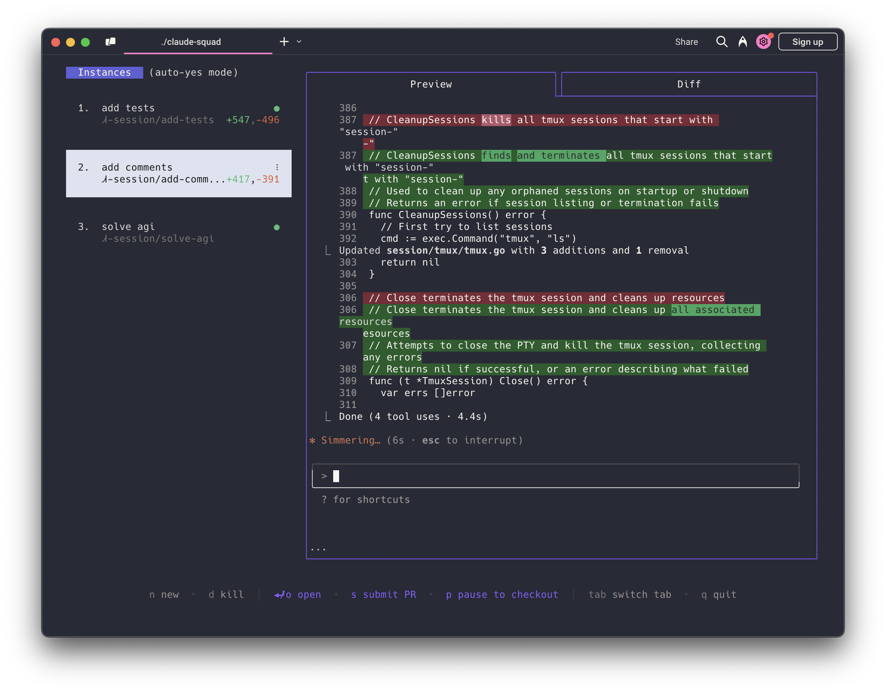

# Hivemind [](https://github.com/ByteMirror/hivemind/actions/workflows/build.yml) [](https://github.com/ByteMirror/hivemind/releases/latest) [](https://www.gnu.org/licenses/agpl-3.0)

A TUI-based agent-driven IDE that manages multiple [Claude Code](https://github.com/anthropics/claude-code), [Codex](https://github.com/openai/codex), [Gemini](https://github.com/google-gemini/gemini-cli), [Amp](https://github.com/anthropics/amp) and other AI agents in isolated workspaces, so you can work on multiple tasks simultaneously.



### Highlights
- Complete tasks in the background (including yolo / auto-accept mode)
- Manage all your agent instances and tasks in one terminal window
- Review changes before applying them, checkout changes before pushing
- Each task gets its own isolated git workspace — no conflicts

### Installation

#### Homebrew

```bash
brew install ByteMirror/tap/hivemind
```

#### Install Script

```bash
curl -fsSL https://raw.githubusercontent.com/ByteMirror/hivemind/main/install.sh | bash
```

This installs the `hivemind` binary in `~/.local/bin`.

To install with a custom name (e.g. `hm`):

```bash
curl -fsSL https://raw.githubusercontent.com/ByteMirror/hivemind/main/install.sh | bash -s -- --name hm
```

#### Download Binary

Pre-built binaries for macOS, Linux, and Windows are available on the [Releases page](https://github.com/ByteMirror/hivemind/releases/latest).

### Prerequisites

- [tmux](https://github.com/tmux/tmux/wiki/Installing)
- [gh](https://cli.github.com/)

### Usage

```
Usage:
  hivemind [flags]
  hivemind [command]

Available Commands:
  completion  Generate the autocompletion script for the specified shell
  debug       Print debug information like config paths
  help        Help about any command
  reset       Reset all stored instances
  version     Print the version number of hivemind

Flags:
  -y, --autoyes          [experimental] If enabled, all instances will automatically accept prompts
  -h, --help             help for hivemind
  -p, --program string   Program to run in new instances (e.g. 'aider --model ollama_chat/gemma3:1b')
```

Run the application with:

```bash
hivemind
```

NOTE: The default program is `claude` and we recommend using the latest version.

<br />

<b>Using Hivemind with other AI assistants:</b>
- For [Codex](https://github.com/openai/codex): Set your API key with `export OPENAI_API_KEY=<your_key>`
- Launch with specific assistants:
   - Codex: `hivemind -p "codex"`
   - Aider: `hivemind -p "aider ..."`
   - Gemini: `hivemind -p "gemini"`
- Make this the default by modifying the config file (locate with `hivemind debug`)

<br />

#### Menu
The menu at the bottom of the screen shows available commands:

##### Instance/Session Management
- `n` - Create a new session
- `N` - Create a new session with a prompt
- `D` - Kill (delete) the selected session
- `↑/j`, `↓/k` - Navigate between sessions

##### Actions
- `↵/o` - Attach to the selected session to reprompt
- `ctrl-q` - Detach from session
- `s` - Commit and push branch to github
- `c` - Checkout. Commits changes and pauses the session
- `r` - Resume a paused session
- `?` - Show help menu

##### Navigation
- `tab` - Switch between preview tab and diff tab
- `q` - Quit the application
- `shift-↓/↑` - Scroll in diff view

### How It Works

1. **tmux** to create isolated terminal sessions for each agent
2. **git worktrees** to isolate codebases so each session works on its own branch
3. A TUI interface for easy navigation and management

### Attribution

Hivemind is a fork of [claude-squad](https://github.com/smtg-ai/claude-squad) by smtg-ai.

### License

[AGPL-3.0](LICENSE.md)
