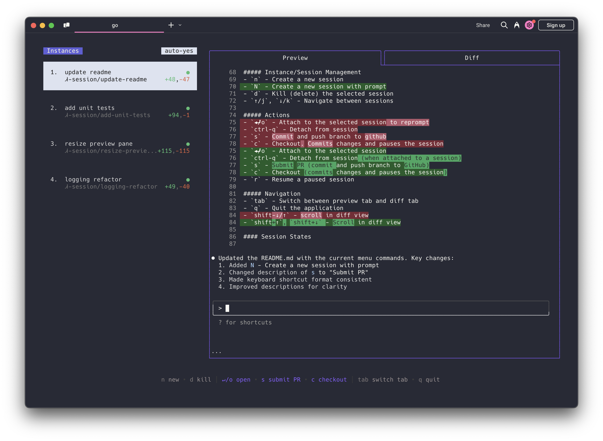

# Agent Farmer [](https://github.com/howinator/agent-farmer/actions/workflows/build.yml) [](https://github.com/howinator/agent-farmer/releases/latest)

[Agent Farmer](https://smtg-ai.github.io/agent-farmer/) is a terminal app that manages multiple [Claude Code](https://github.com/anthropiaf/claude-code), [Codex](https://github.com/openai/codex) (and other local agents including [Aider](https://github.com/Aider-AI/aider)) in separate workspaces, allowing you to work on multiple tasks simultaneously.




### Highlights
- Complete tasks in the background (including yolo / auto-accept mode!)
- Manage instances and tasks in one terminal window
- Review changes before applying them, checkout changes before pushing them
- Each task gets its own isolated git workspace, so no conflicts

<br />

https://github.com/user-attachments/assets/aef18253-e58f-4525-9032-f5a3d66c975a

<br />

### Installation

Both Homebrew and manual installation will install Agent Farmer as `af` on your system.

#### Homebrew

```bash
brew install agent-farmer
ln -s "$(brew --prefix)/bin/agent-farmer" "$(brew --prefix)/bin/af"
```

#### Manual

Agent Farmer can also be installed by running the following command:

```bash
curl -fsSL https://raw.githubusercontent.com/howinator/agent-farmer/main/install.sh | bash
```

This puts the `af` binary in `~/.local/bin`.

To use a custom name for the binary:

```bash
curl -fsSL https://raw.githubusercontent.com/howinator/agent-farmer/main/install.sh | bash -s -- --name <your-binary-name>
```

### Prerequisites

- [tmux](https://github.com/tmux/tmux/wiki/Installing)
- [gh](https://cli.github.com/)

### Usage

```
Usage:
  af [flags]
  af [command]

Available Commands:
  completion  Generate the autocompletion script for the specified shell
  debug       Print debug information like config paths
  help        Help about any command
  reset       Reset all stored instances
  version     Print the version number of agent-farmer

Flags:
  -y, --autoyes          [experimental] If enabled, all instances will automatically accept prompts for claude code & aider
  -h, --help             help for agent-farmer
  -p, --program string   Program to run in new instances (e.g. 'aider --model ollama_chat/gemma3:1b')
```

Run the application with:

```bash
af
```

<br />

<b>Using Agent Farmer with other AI assistants:</b>
- For [Codex](https://github.com/openai/codex): Set your API key with `export OPENAI_API_KEY=<your_key>`
- Launch with specific assistants:
   - Codex: `af -p "codex"`
   - Aider: `af -p "aider ..."`
- Make this the default, by modifying the config file (locate with `af debug`)

<br />

#### Menu
The menu at the bottom of the screen shows available commands: 

##### Instance/Session Management
- `n` - Create a new session
- `N` - Create a new session with a prompt
- `D` - Kill (delete) the selected session
- `↑/j`, `↓/k` - Navigate between sessions

##### Actions
- `↵/o` - Attach to the selected session to reprompt
- `ctrl-q` - Detach from session
- `s` - Commit and push branch to github
- `c` - Checkout. Commits changes and pauses the session
- `r` - Resume a paused session
- `?` - Show help menu

##### Navigation
- `tab` - Switch between preview tab and diff tab
- `q` - Quit the application
- `shift-↓/↑` - scroll in diff view

### How It Works

1. **tmux** to create isolated terminal sessions for each agent
2. **git worktrees** to isolate codebases so each session works on its own branch
3. A simple TUI interface for easy navigation and management

### License

[AGPL-3.0](LICENSE.md)

### Star History

[](https://www.star-history.com/#howinator/agent-farmer&Date)
